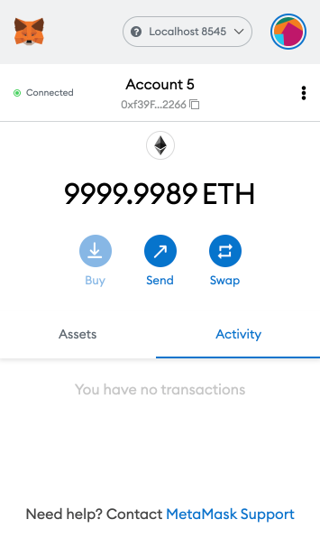
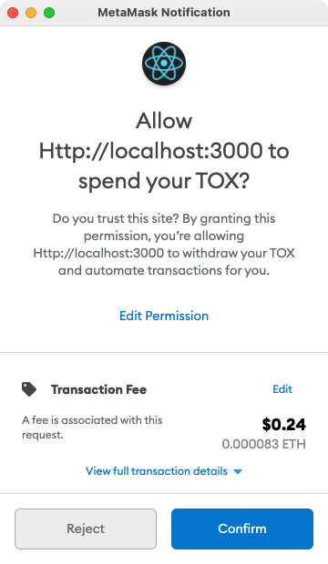
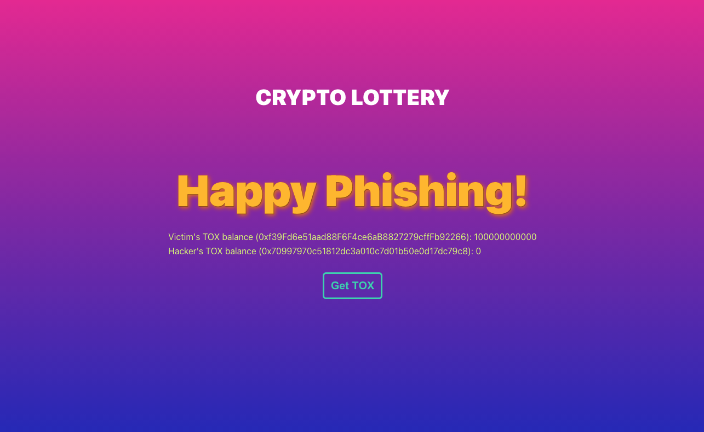
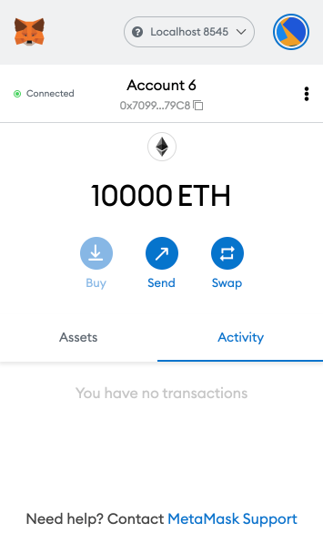
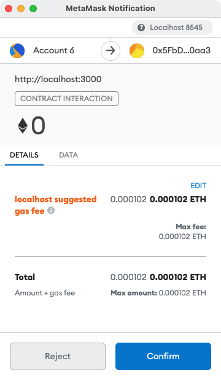
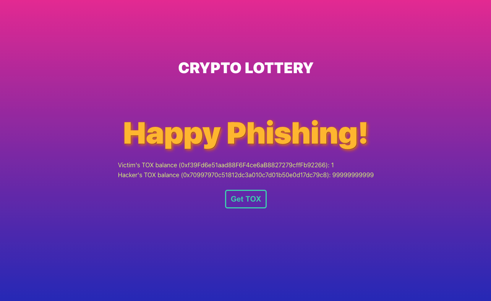
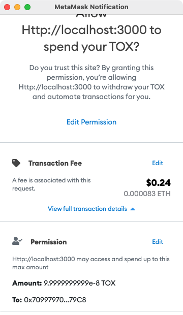
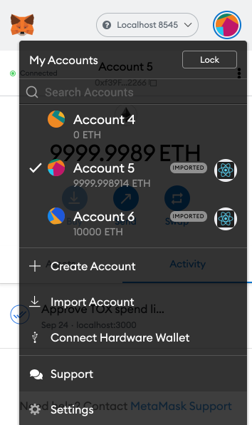
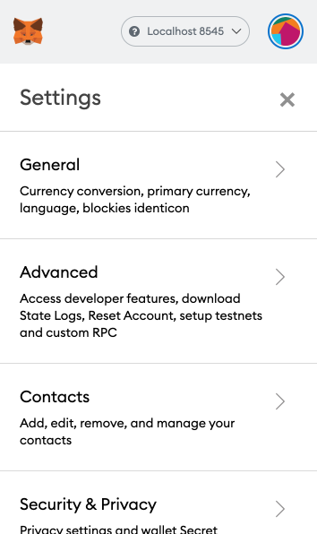
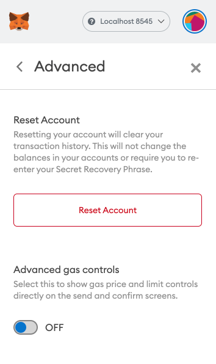

# erc20-token-scam
A phishing website to demonstrate how a hacker can steal your ERC-20 tokens with the approve and transferFrom functions, and the risk of confirming token transfer approval without checking transaction details carefully. This website is just for educational purposes only.

### Version
- [Solidity](https://solidity.readthedocs.io/): 0.8.4
- [MetaMask](https://metamask.io/): 10.1.1
- [hardhat](https://nodejs.org/en/): 2.6.1
- [ethers](https://docs.ethers.io/): 5.4.5
- [Node.js](https://nodejs.org/en/): 16.9.1
- [@openzeppelin/contracts](https://openzeppelin.com/): 4.3.2

### ERC-20 Token
##### Installation
Install Node.js.
```
brew install node
```

Install the required Node.js packages in this project including `hardhat`, `ethers` and `@openzeppelin/contracts`.
```
npm install
```

##### Configuration
By default, Hardhat will create 20 accounts and preload each with 10000 ETH on your local blockchain network. If you want to connect to other Ethereum networks, you will need to update the Hardhat configuration file `hardhat.config.js`. The artifacts output path is set to `./dapp/src/artifacts` since the DApp needs to use the ABI in the artifacts.

##### Deployment
1. Run Hardhat Network.
    ```
    npx hardhat node
    ```

2. Compile the smart contracts.
    ```
    npx hardhat compile
    ```

3. Deploy the smart contracts.
    ```
    npx hardhat run scripts/deploy.js --network localhost
    ```

##### MetaMask
1. Install MetaMask extension in Chrome.

2. After running `npx hardhat node`, a list of accounts will be shown on the terminal. Import Account #0 and Account #1 to your MetaMask wallet.

### DApp
##### Installation
Change current directory to `dapp` and install the required Node.js packages in this DApp including `React` and `ethers`.
```
npm install
```

##### Configuration
In `dapp` directory, create a `.env` file containing the address of the deployed Token smart contract and 1 account address you imported to MetaMask wallet as the hacker account. Since this DApp is created from `create-react-app`, the environment variables should start with `REACT_APP_`.
```
REACT_APP_CONTRACT_ADDRESS="0x5FbDB2315678afecb367f032d93F642f64180aa3"
REACT_APP_HACKER_ADDRESS="0x70997970c51812dc3a010c7d01b50e0d17dc79c8"
```

##### Get Started
In `dapp` directory, run the application.
```
npm start
```

1. Open Chrome and go to `http://localhost:3000/`. Click Play Now.
    <br/>
    

2. Connect MetaMask to `Localhost 8545` and select the victim account. Click Retry on our phishing website.
    <br/>
    
    <br/>
    

3. Buy a ticket. Confirm the transaction and wait until the transaction is confirmed.
    <br/>
    
    <br/>
    

4. Now hacker is authorized to spend TOX from victim's account. Go to `http://localhost:3000/hidden`. We can see victim's TOX balance is still 100000000000 and hacker is 0.
    <br/>
    

5. Let's steal victim's TOX! Switch to hacker account in the MetaMask wallet. Click Get TOX and confirm the transaction.
    <br/>
    
    <br/>
    

6. Reload `http://localhost:3000/hidden`. Victim's TOX balance now becomes 1 and hacker is 99999999999!
    <br/>
    

### Phishing Attack Prevention
Check the full transaction details carefully before confirming any transactions. In this phishing website, the ticket fee is intentionally set to a price same as the estimated transaction fee so as to mislead the users. In fact, the transaction fee is just a service charge you should pay along with the ticket fee. From the example above, if we expand the transaction details, we can see the amount that allows hacker to spend is 9.9999999999e-8 TOX (99999999999). It is extremely dangerous to authorize any accounts to spend your tokens without checking the amount in Permission.
<br/>


### Account Cleanup
If you want to clean up your accounts and play again, you may need to clean the cache and artifacts using the following command. Then restart Hardhat Network, recompile and redeploy the Token smart contract.
```
npx hardhat clean
```

To reset the nonce for a account in the MetaMask wallet, navigate to Settings, go into Advanced and click Reset Account.
<br/>

<br/>

<br/>
